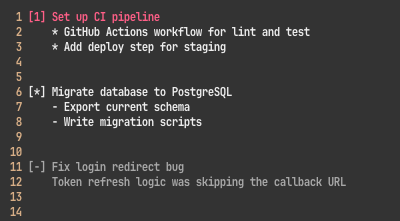

# vim-todo

Syntax highlighting and auto-indentation for `TODO` files in Vim.

## File Format

Tasks have a numeric index when active, `[*]` when planned, and `[-]` when
done, followed by a title. Indented lines below a task are its content.
Content lines can use `*` or `-` as list markers.

```
[1] Set up CI pipeline
    * GitHub Actions workflow for lint and test
    * Add deploy step for staging

[*] Migrate database to PostgreSQL
    - Export current schema
    - Write migration scripts

[-] Fix login redirect bug
    Token refresh logic was skipping the callback URL
```



## Highlighting

Active tasks display the index and title (`[1] title`) in `Identifier` color.
Content lines under active tasks use `Normal` color.

Planned tasks (`[*]`) display the marker and title in blue.
Content lines under planned tasks use `Normal` color.

Completed tasks (`[-]`) are entirely greyed out using `Comment` color -- marker,
title, and content.

List markers (`*` and `-`) at the beginning of content lines are displayed in
green across all task types.

## Indentation

The plugin automatically indents content lines under task titles. After typing
a task title (`[1] ...`, `[*] ...`, or `[-] ...`) and pressing Enter, the
cursor is indented by 4 spaces. The indent is maintained for subsequent content
lines.

Two or more consecutive blank lines reset the indent to column 0, so you can
start a new task at the top level.

## Installation

### Vim packages (Vim 8+)

```bash
mkdir -p ~/.vim/pack/plugins/start
git clone https://github.com/kuangyujing/vim-todo.git ~/.vim/pack/plugins/start/vim-todo
```

### vim-plug

Add to your vimrc:

```vim
Plug 'kuangyujing/vim-todo'
```

Then run `:PlugInstall`.

## Settings

The plugin sets the following buffer-local options for `TODO` files:

- `expandtab` -- tabs insert spaces
- `shiftwidth=4`
- `softtabstop=4`

## Project Structure

```
vim-todo/
├── ftdetect/
│   └── todo.vim       filetype detection for TODO files
├── syntax/
│   └── todo.vim       syntax highlighting
├── indent/
│   └── todo.vim       auto-indentation
└── ftplugin/
    └── todo.vim       buffer-local settings
```

## Development

This is a syntax-only plugin -- no commands or key mappings. Filetype is `todo`.

Highlight groups:

| Group | Pattern | Color |
|---|---|---|
| `todoIndex` | `[N]` | `Identifier` |
| `todoTitle` | title after `[N]` | `Identifier` |
| `todoContent` | indented lines under active tasks | `Normal` |
| `todoPlannedMarker` | `[*]` | Blue |
| `todoPlannedTitle` | title after `[*]` | Blue |
| `todoPlannedContent` | indented lines under planned tasks | `Normal` |
| `todoDoneMarker` | `[-]` | `Comment` |
| `todoDoneTitle` | title after `[-]` | `Comment` |
| `todoDoneContent` | indented lines under done tasks | `Comment` |
| `todoListMarker` | `*` or `-` in content lines | Green |

Indent logic (`indent/todo.vim`):

- Lines starting with `[` always return to column 0
- After a task title, indent by `shiftwidth` (4 spaces)
- After 2+ consecutive blank lines, indent resets to 0
- Otherwise, maintain the indent of the previous non-blank line
